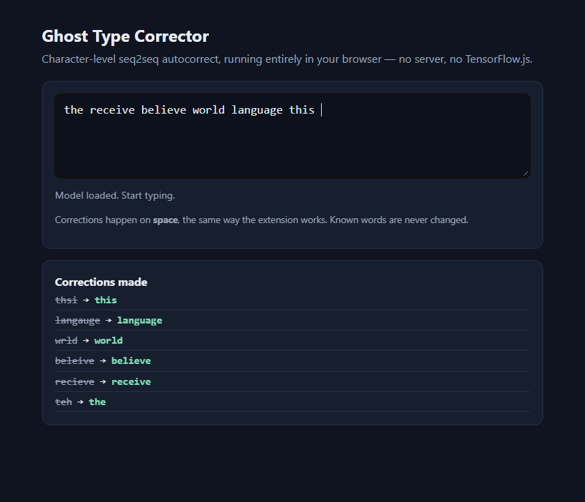

# Ghost Type Corrector

An **invisible, client-side autocorrect** for the browser, powered by a
character-level sequence-to-sequence neural network. You type, and on the
spacebar a misspelled word is quietly fixed in place — no popups, no red
underlines, no "did you mean?". The whole model runs **in your browser**: no
server, no API calls, and no TensorFlow.js — just a small hand-written
inference engine in plain JavaScript.



## Where this fits (a 4-part exploration)

This is **Phase 2** of a four-project exploration of automatic typing
correction, each phase a response to the limits of the last:

1. **[invisible-autocorrect-extension](https://github.com/JampaniKomal/invisible-autocorrect-extension)** — the idea, using a frequency dictionary (no ML).
2. **Ghost Type Corrector** (this repo) — replace the dictionary with a real
   neural seq2seq model, running inside the browser extension.
3. **[Type-Correcter-Ai](https://github.com/JampaniKomal/Type-Correcter-Ai)** — move the trained model to a Flask web app, to get it off the browser's main thread.
4. **[AI_Corrector_Project](https://github.com/JampaniKomal/AI_Corrector_Project)** — go system-wide: a T5-Transformer desktop corrector that works in *any* app, not just web pages.

The honest lesson of Phase 2 — a browser extension only ever sees web text
fields, and a per-keystroke neural model is awkward to ship there — is exactly
what motivated Phases 3 and 4.

## How it works

```
corpus of English text
        │  01_build_dataset.py   (keep the most frequent words -> dictionary.txt)
        ▼
word pairs: (misspelled -> correct)      02_train_model.py
        │  identity pairs teach it to leave correct words alone;
        │  delete / insert / substitute / swap typos teach it to fix them
        ▼
char-level seq2seq LSTM (encoder + decoder)   ~0.2M params, ~3 MB
        │  03_export_for_browser.py   (weights -> NumPy .npz and base64 JSON)
        ▼
inference = greedy/beam decode  +  dictionary gate
        ├── Python:  ai_model/src/inference.py   (NumPy only)
        └── Browser: extension/js/inference.js   (plain JS, no dependencies)
```

Two design choices do most of the work:

- **A dictionary gate.** The neural model *proposes*; the dictionary *decides*.
  A word already in the dictionary is never touched, and a proposal is only
  accepted if it is itself a real word. This is what stops an autocorrect from
  "fixing" words that were already right — on a held-out sample it changes a
  correct word **0%** of the time.
- **Beam search.** The top greedy guess is often a near-miss non-word, so the
  decoder keeps several candidates and the gate picks the best one that is a
  real word. That roughly doubles the real correction rate.

## Does it actually work?

Yes. Measured on held-out single-typo words (never seen in training), with the
bundled model:

| Metric | Result |
|---|---|
| Keeps a correct word unchanged | **100%** |
| Fixes a misspelling to the exact right word | **~58%** |
| Invents a non-word | never (the gate forbids it) |

```
teh -> the      recieve -> receive    beleive -> believe
wrld -> world   thsi -> this          langauge -> language
```

It is a small character model, so it has a real ceiling: two-error words
(`definately` → `definitely`), word splits (`alot` → `a lot`), and genuine
real-word confusions (it may read `wich` as `witch`) are out of reach. That
ceiling is honest, and it is part of why the series moved to larger models.

## Try it

No build step — the trained model is committed. Serve the `extension/` folder
and open the demo:

```bash
cd extension
python -m http.server 8000
# open http://localhost:8000/demo.html
```

Or load it as a Chrome extension: `chrome://extensions` → Developer mode →
**Load unpacked** → select the `extension/` folder, then type in any text box.

## Retrain it yourself

```bash
pip install -r requirements.txt           # TensorFlow, for training only
cd ai_model/src
python 01_build_dataset.py                # uses the bundled sample corpus
python 02_train_model.py                  # ~6 min on a laptop CPU
python 03_export_for_browser.py           # writes extension/model/*
```

`01` defaults to the small bundled `ai_model/data/sample_corpus.txt`; point it
at a larger corpus for a stronger model. The committed model was trained on the
[Leipzig Corpora Collection](https://wortschatz.uni-leipzig.de/en/download)
(British English).

## Project structure

```
Ghost-Type-Corrector/
├── ai_model/
│   ├── src/
│   │   ├── 01_build_dataset.py        # corpus  -> dictionary
│   │   ├── 02_train_model.py          # dictionary -> trained seq2seq (.h5)
│   │   ├── 03_export_for_browser.py   # .h5 -> weights.npz / weights.json
│   │   ├── inference.py               # NumPy decoder + dictionary gate
│   │   └── typos.py                   # the four synthetic typo kinds
│   ├── data/
│   │   ├── sample_corpus.txt          # small bundled corpus (runs out of the box)
│   │   ├── dictionary.txt             # the word list / inference gate
│   │   └── tokenizer_config.json
│   └── autocorrect_model.h5           # the trained model
├── extension/                         # Manifest V3 Chrome extension
│   ├── js/
│   │   ├── content.js                 # watches text fields, applies corrections
│   │   ├── inference.js               # the model, in plain JavaScript
│   │   └── sandbox_logic.js           # runs inference.js in the extension sandbox
│   ├── model/                         # weights.json, tokenizer, dictionary
│   ├── demo.html                      # try it without installing
│   ├── sandbox.html
│   └── manifest.json
├── tests/                             # pytest + a Node parity test
└── .github/workflows/ci.yml
```

## Tests

```bash
pip install -r requirements-dev.txt
pytest                               # inference + typo generation (NumPy only)
node tests/inference.node.test.js    # browser engine matches the Python reference
```

CI runs ruff, the Python tests on 3.10–3.12, and the JavaScript parity test on
every push.

## What changed from the archived version

The earlier version of this repo looked finished but did not actually run:

- **The browser inference was never wired up.** `sandbox.html` loaded a
  `tf.min.js` that was never committed, and the TensorFlow.js model it expected
  was never exported — the extension could not run at all. It now runs a
  **dependency-free JavaScript inference engine** (no TensorFlow.js), which is
  both lighter and the thing that was actually missing.
- **The model didn't correct.** The committed model collapsed to emitting
  frequent words regardless of input (it was trained on whole sentences but
  used on single words). It has been **retrained word-by-word**, matching how
  the extension actually calls it, and gated by a dictionary.
- **The docs described files that didn't exist** (a whole `docs/` tree, a
  `convert_direct.py`). The README now matches the repository.

See [CHANGELOG.md](CHANGELOG.md) for details.

## Limitations

- **Web text fields only** — it is a browser extension; it cannot correct other
  applications (that is what Phase 4 is for).
- **One word at a time, dictionary-bounded** — it corrects the current word
  against a fixed word list; it does not use sentence context and cannot split
  or join words.
- **Small-model ceiling** — see "Does it actually work?" above.
- **English, lower-case** — trained on a British-English corpus; the extension
  restores the original capitalization after correcting.

## Acknowledgements

- Training text: [Leipzig Corpora Collection](https://wortschatz.uni-leipzig.de/en/download), Leipzig University.

## License

MIT — see [LICENSE](LICENSE).
